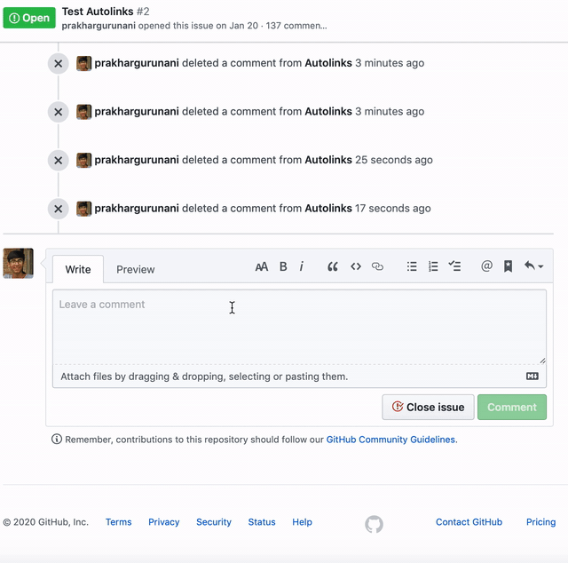

# [Autolinks](https://github.com/prakhargurunani/Autolinks)

A GitHub app for web scraping

## About
_Autolink lets you instantly share web links related to a particular topic by just using keywords._

## Installation
* Go to the homepage of the app - https://github.com/apps/autolinks
* Click on the Configure button
* Add repositories or organizations to activate Autolinks

## Usage
_Autolinks_ currently works only for GitHub Issues. Extending it to PRs will be planned in future or if any developer is interested, he may work on this feature.

`@Autolinks <search_query> <number_of_results>`

Here,
* `<search_query>`(`str`): The term you want to be googled. (Cannot be empty)
* `<number_of_results>`(`int`): The number of results you want for a query. (Min:1, Max:9)

## Example
`@Autolinks Win 7 DLL file error 5` will return first `5` search results related to the topic `Win 7 DLL file error`.

You can also test it live [here](https://github.com/FirePing32/Autolinks/issues/2#issue-comment-box).

## Private Repositories
This app will only work for publicly hosted repositories. So if you are looking to deploy a fork or **use the app for private repositories**, [here are the instructions](https://github.com/prakhargurunani/Autolinks/wiki/Instructions-to-deploy-a-fork).
